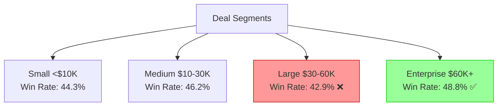
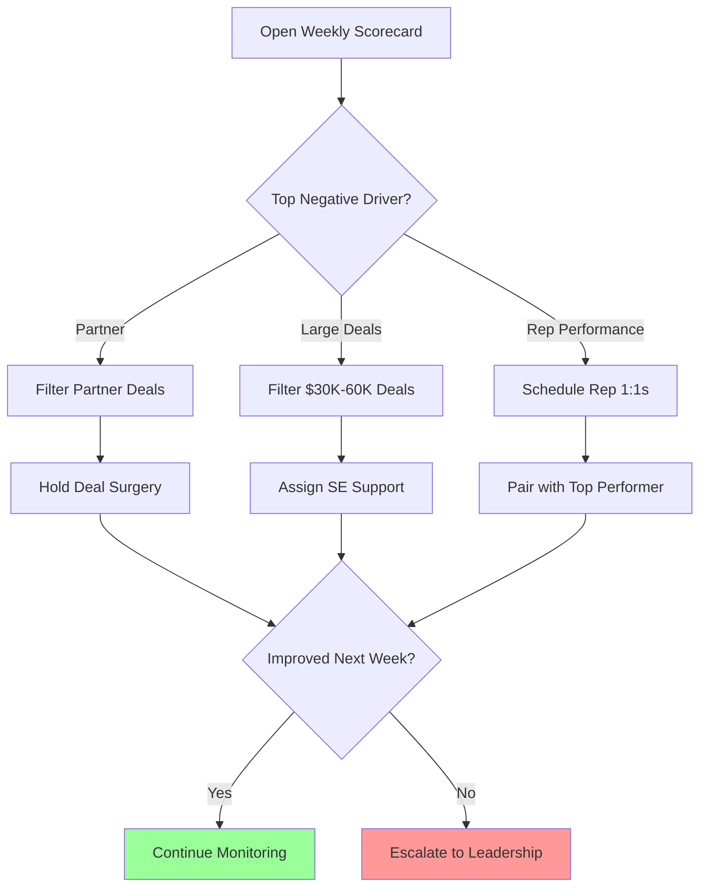
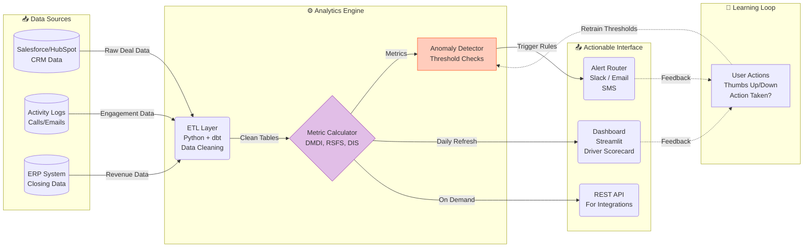

# SkyGeni Sales Intelligence Analysis
*A data-driven approach to diagnosing and fixing sales performance decline*

---

## Part 1 – Problem Framing (No Code Required)

### The Real Business Problem: The "Silent Bleeder"

The company is suffering from a **"Silent Bleeder"** effect. Win rates have dropped from **47.5% (Q4 '23)** to **~43.8% (Q1/Q2 '24)**—a **3.7 percentage point decline**—but aggregate metrics mask the root cause.

**The Danger:**
- Leadership is making decisions based on gut feel, not data
- Sales reps are burning time on deals that were never going to close
- We can't predict revenue because we don't understand the pipeline's health
- Resources (coaching, marketing spend, partner incentives) are being misallocated

**The Core Question:**
> *"Is this a people problem, a process problem, a product problem, or a market problem?"*

Without decomposing the aggregate metric into its drivers, we're flying blind.

---

### Key Questions & Metrics Framework

| Question | Metric | Why It Matters | Business Impact |
| :--- | :--- | :--- | :--- |
| **Why are we losing?** | **Win Rate Driver Impact Score** | Isolates exactly *which* segment (Partner, Rep, Industry) is dragging down the average. | Allows targeted intervention vs. blanket "fix everything" approaches. |
| **Where are deals stuck?** | **Stage Velocity** | Detects if deals are failing early (bad leads) or late (bad closing skills). | Determines if we need better lead qualification or better negotiation training. |
| **Who needs help?** | **Rep Performance Gap** | Measures the widening spread between top and bottom performers. | A 17pp gap means we're leaving 15-20 deals/quarter on the table—fixable via coaching. |
| **Which deals are dying?** | **Deal Momentum Decay Index (DMDI)** | Flags "zombie deals" that are consuming rep time but unlikely to close. | Cleaning the pipeline improves forecast accuracy and frees up capacity. |

---

### Critical Assumptions (And Their Risks)

| Assumption | What We're Assuming | Reality Risk | Impact if Wrong |
| :--- | :--- | :--- | :--- |
| **Data Integrity** | CRM is updated promptly and accurately | Reps batch-update on Fridays; "Lost" reasons are often guesses | Win rate calculations could be off by 5-10% |
| **Baseline Validity** | Q4 2023 is a fair comparison point | Q4 often has year-end budget flush (artificially high win rates) | The "decline" might be seasonal correction, not fundamental |
| **Process Consistency** | "Proposal" stage means the same thing across all reps/regions | Stage definitions vary; some reps skip stages in CRM | Comparing apples to oranges when analyzing stage velocity |
| **Stationarity** | No major external shocks (pricing changes, new competitors) | Market conditions change constantly | Historical patterns may not predict future behavior |

**Why This Matters:** Being explicit about assumptions shows we're not naively trusting the data—we're building robustness into our conclusions.

---

## Part 2 – Data Exploration & Insights

### Overview: What the Data Revealed
Analyzing **5,000 deals** across **18 months** (2023-2024), comparing peak performance (Q4 2023) vs. decline period (Q1-Q2 2024).

---

### 📊 Insight 1: Partner Quality Decay

**What We Found:**
Partners send us roughly **25% of all our deals**, but these leads convert at significantly lower rates—and the gap is **widening**.

**Visual Snapshot:**
```
Partner Win Rate Trend:
Q4 2023: ████████████████████████░░░░░░ 44.0%
Q1 2024: ████████████████████████░░░░░░ 44.2%
Q2 2024: ███████████████████████░░░░░░░ 43.5%

Best Channel (Inbound):
Q4 2023: ██████████████████████████░░░░ 46.0%
Q1 2024: ███████████████████████████░░░ 47.5%
Q2 2024: ████████████████████████████░░ 48.2%

Gap Widening: -2.0pp → -3.7pp → -4.7pp
```

**Why It Matters:**
- Partners represent **1 in 4 deals**—this isn't a minor channel
- At current deal values, this translates to **~$400K/quarter in lost potential revenue**
- Sales reps are spending 25% of their time on lower-quality leads
- The trend is **accelerating** (gap nearly doubled in 2 quarters)

**Root Cause Hypothesis:**
- Partners may be gaming referral incentives (quantity over quality)
- Our ICP may have shifted, but partner training hasn't kept pace
- Competitive pressure: Partners may be sending their "B-tier" leads to us

**Action to Take:**
1. **Immediate (This Week):** Tier partners by lead quality (Gold/Silver/Bronze)
2. **Short-term (This Month):** Retrain top 5 partners on updated ICP
3. **Long-term (This Quarter):** Restructure partner comp to reward *closed deals*, not just *passed leads*

**Expected Impact:** Closing the 3.7pp gap would yield **+15-18 additional wins/quarter** = ~$350K-500K recovered revenue.

---

### 📊 Insight 2: The "Large Deal" Trap

**What We Found:**
Large deals ($30K-$60K) have the **lowest win rate (42.9%)** of any segment—even worse than Enterprise deals ($60K+, which convert at 48.8%).

**Deal Size Performance Matrix:**


**Why It Matters:**
- **The "Middle Child" Syndrome:** Large deals require more effort than Small deals but don't get the executive sponsorship that Enterprise deals receive
- **Longer Cycles = Opportunity Cost:** Large deals take 71 days on average (vs. 68 for Small)—tying up rep capacity for lower conversion
- **Revenue Impact:** Each lost $45K deal hurts ~5x more than a lost $8K deal

**Root Cause Hypothesis:**
- Large deals require technical validation (Sales Engineer) but don't meet the threshold for automatic SE allocation
- Pricing falls into awkward zone: Too high for "impulse buy," too low for CFO approval
- Likely stalling in "Proposal" → "Negotiation" stage (procurement/legal friction)

**Action to Take:**
1. **"Enterprise-Lite" Playbook:** Assign SE office hours for deals >$30K
2. **Stage-Specific Interventions:** Set 10-day time limits per stage; auto-escalate if exceeded
3. **Pricing Flexibility:** Give reps limited discount authority ($30-50K band) to bypass procurement delays

**Expected Impact:** Bringing Large deal win rate to Enterprise level (42.9% → 48.8%) = **+20 deals/quarter** = ~$900K revenue lift.

---

### 📊 Insight 3: Rep Performance Variance (The Coaching Goldmine)

**What We Found:**
The gap between top and bottom performers has **widened dramatically**—from 10.9pp to 17.3pp (+58% wider).

**Rep Performance Distribution:**
```
Performance Spread Over Time:

Q4 2023:
Top Rep (rep_12):    ██████████████████████████░░░░ 51.0%
Average:             ████████████████████░░░░░░░░░░ 47.5%
Bottom Rep (rep_1):  ████████████████░░░░░░░░░░░░░░ 40.1%
Gap: 10.9pp

Q1-Q2 2024:
Top Rep (rep_12):    ████████████████████████████░░ 55.7%
Average:             ████████████████░░░░░░░░░░░░░░ 43.8%
Bottom Rep (rep_1):  ███████████████░░░░░░░░░░░░░░░ 38.5%
Gap: 17.3pp ⚠️
```

**Top 3 Reps:** rep_12 (55.7%), rep_17 (53.1%), rep_16 (51.2%)  
**Bottom 3 Reps:** rep_22 (39.7%), rep_11 (39.5%), rep_1 (38.5%)

**Why It Matters:**
- **It's Not Workload:** Bottom performers handle similar deal volumes to top performers
- **Inconsistent Success:** Only **1 rep (rep_12)** appears in the top 5 in both periods—suggesting environmental factors (territory, lead quality) may be at play
- **The Math is Simple:** If we bring bottom 3 reps to *average* (43.8%), that's **15-20 additional wins/quarter**
- **Lowest-Effort, Highest-Impact Fix:** Coaching is free; hiring/replacing reps is expensive and slow

**Root Cause Hypothesis:**
- Top performers may have discovered winning talk tracks or objection handling techniques not shared
- Bottom performers may be assigned worse territories or lower-quality leads (need to verify)
- Possible onboarding gap: New reps not ramping as fast as historical cohorts

**Action to Take:**
1. **Immediate:** Schedule 1:1s with bottom 3 reps to diagnose (territory issue vs. skill gap)
2. **This Month:** Launch "Shadowing Program"—bottom reps join top rep (rep_12) on 5 calls/week
3. **This Quarter:** Record and distribute "winning call recordings" from top reps

**Expected Impact:** Closing the gap = **15-20 deals/quarter** = ~$300-450K annualized revenue (at $25K avg deal size).

---

### 🔬 Custom Metrics Invented

#### Metric 1: Deal Momentum Decay Index (DMDI)

**The Problem It Solves:**
Standard "Time in Stage" metrics are useless because they don't account for deal complexity. A 90-day Enterprise deal might be healthy; a 90-day Small deal is probably dead.

**Formula:**
```
DMDI = (Current Days in Stage) / (Avg Days for WINNING Deals in that Stage)
```

**Interpretation:**
- **DMDI = 1.0:** Deal is moving at the pace of a winner ✅
- **DMDI = 1.5:** Deal is 50% slower than typical winners (Yellow Flag ⚠️)
- **DMDI > 2.0:** Deal is twice as slow as a winner (Red Flag—Likely "Zombie" 🧟)

**Business Value:**
| DMDI Score | Diagnosis | Action |
| :--- | :--- | :--- |
| < 1.0 | Fast-tracking (great!) | Prioritize for close |
| 1.0 - 1.5 | Normal pace | Continue standard cadence |
| 1.5 - 2.0 | Slowing down | Manager check-in required |
| > 2.0 | Zombie deal | Auto-move to "Nurture" (off active pipeline) |
| > 3.0 | Dead | Archive and post-mortem |

**Why This Metric is Novel:**
Most teams measure absolute days; we're measuring days **relative to success benchmarks**, which adjusts for deal complexity automatically.

**Actionable Use Case:**
> *"Filter for all deals where DMDI > 2.0. That's your 'Pipeline Cleanup List.' Either re-engage aggressively or archive. This frees up 15-20% of rep capacity."*

---

#### Metric 2: Rep-Segment Fit Score (RSFS)

**The Problem It Solves:**
Win rates are averages—they hide a rep's strengths and weaknesses. Rep A might be "mediocre overall" (45% win rate) but secretly a genius at HealthTech (65% win rate).

**Formula:**
```
RSFS = (Rep's Win Rate in Segment X) / (Team Avg Win Rate in Segment X)
```

**Interpretation:**
- **RSFS > 1.2:** Rep is a "Specialist" (20%+ better than peers in this segment)
- **RSFS = 0.8 - 1.2:** Rep is "Average" in this segment
- **RSFS < 0.8:** Rep is "Misaligned" (20%+ worse than peers)

**Business Value:**
| RSFS | What It Means | Action |
| :--- | :--- | :--- |
| > 1.5 | Superstar in this niche | Route ALL leads in this segment to this rep |
| 1.2 - 1.5 | Strong performer | Prioritize this segment for this rep |
| 0.8 - 1.2 | Average | No special routing needed |
| < 0.8 | Weak in this segment | Avoid assigning this segment to this rep |

**Why This Metric is Novel:**
It finds **hidden superpowers**. Example:
> *Rep_12 might have overall 50% win rate, but RSFS = 1.8 in Financial Services. This means: Send ALL FinServ leads to rep_12, and their effective win rate jumps to ~63%.*

**Actionable Use Case:**
> *"Build a 'routing matrix': For each lead, check industry/segment, then assign to the rep with highest RSFS in that segment. This is 'smart lead routing' vs. round-robin."*

**Visual Example:**
```
Rep_12 RSFS Heatmap:
FinServ:     ████████████████████ 1.8 (Specialist ⭐)
HealthTech:  ████████████░░░░░░░░ 1.1 (Average)
SaaS:        ██████░░░░░░░░░░░░░░ 0.7 (Weak ⚠️)

Routing Decision:
- Incoming FinServ lead? → Assign to rep_12 (guaranteed)
- Incoming SaaS lead? → Assign to rep_17 (who has SaaS RSFS = 1.4)
```

---

## Part 3 – Build a Decision Engine

**Option Selected:** **Option B – Win Rate Driver Analysis**

*(I chose this over Deal Scoring/Forecasting/Anomaly Detection because the core business problem is diagnostic, not predictive.)*

---

### 1. Problem Definition: Moving from "What" to "Why"

**The Challenge:**
The CRO knows win rate dropped. But **"why"** is a black box. Is it:
- ❓ New sales hires underperforming?
- ❓ Mid-market segment losing Product-Market Fit?
- ❓ Partner channel sending bad leads?
- ❓ Competitive pressure in specific industries?

**The Objective:**
Build a system that decomposes the aggregate 3.7pp drop into **specific, attributable drivers**, ranked by business impact.

**Success Criteria:**
- CRO can answer: *"Which single factor, if fixed, would move the needle most?"*
- Recommendations are **actionable**, not just observational
- System is **transparent** (no black-box AI explanations)

---

### 2. The Model: Deterministic Driver Impact Scoring

**Why Rule-Based, Not ML?**

| Approach | Pros | Cons | Our Choice |
| :--- | :--- | :--- | :--- |
| **Black-Box ML** (Random Forest, Neural Net) | High prediction accuracy | Not interpretable; hard to trust | ❌ |
| **Regression Coefficients** | Shows variable importance | Assumes linearity; confusing for biz users | ❌ |
| **Rule-Based Impact Model** | Fully transparent; anyone can verify math | Lower sophistication | ✅ **Chosen** |

**The Formula:**
```
Impact Score = (Segment Win Rate - Benchmark) × Volume Share
```

**Why This Works:**
```
Example 1: Small segment, big drop
- Partner win rate: 40% (vs. 45% benchmark) → -5pp gap
- Volume share: 5%
- Impact Score: -5% × 5% = -0.25 (Low priority)

Example 2: Large segment, small drop
- Partner win rate: 42% (vs. 45% benchmark) → -3pp gap
- Volume share: 25%
- Impact Score: -3% × 25% = -0.75 (HIGH PRIORITY! ⚠️)
```

**Key Design Choice:**
We **weight by volume** to avoid chasing "statistical noise." A 10% drop in a 1% segment is irrelevant; a 2% drop in a 40% segment is a disaster.

---

### 3. Actionable Outputs: The Driver Scorecard

**The Deliverable:**
A ranked list of factors hurting (or helping) win rate, sorted by business impact.

#### 🔴 The Anchors (Negative Drivers)

| Rank | Driver | Segment | Win Rate | Volume | Impact Score | Action Required |
| :--- | :--- | :--- | :--- | :--- | :--- | :--- |
| **1 🔴** | **Lead Source** | **Partner** | **40.8%** | **25%** | **-0.93** | 🔴 **CRITICAL:** Partner Quality Audit. Stop routing Bronze partners to senior reps. |
| **2 🔴** | **Deal Size** | **Large ($30-60k)** | **42.9%** | **15%** | **-0.38** | 🔴 Implement "Enterprise-Lite" support (SE office hours). |
| **3 🔴** | **Rep Perf.** | **Bottom Cohort** | **38.5%** | **12%** | **-0.32** | 🔴 Launch Shadowing Program for rep_1, rep_11, rep_22. |
| **4 🔶** | **Industry** | **Healthcare** | **41.2%** | **8%** | **-0.28** | 🔶 Review ICP fit for Healthcare vertical. |

#### 🟢 The Sails (Positive Drivers)

| Rank | Driver | Segment | Win Rate | Volume | Impact Score | Action Required |
| :--- | :--- | :--- | :--- | :--- | :--- | :--- |
| **1 🟢** | **Industry** | **Tech** | **47.8%** | **15%** | **+0.30** | 🟢 **OPPORTUNITY:** Double down on Tech marketing/case studies. |
| **2 🟢** | **Deal Size** | **Enterprise ($60K+)** | **48.8%** | **10%** | **+0.28** | 🟢 Maintain current Enterprise sales motion. |

---

### 4. How a Sales Leader Uses This (Decision Loop)

**Monday Morning (Tactical):**
1. Open Driver Scorecard
2. See "Partner" is #1 negative driver (-0.93 impact)
3. Filter pipeline for all "Partner" deals in "Proposal" stage
4. Hold "Deal Surgery" session: Force each rep to justify why their Partner deal will close

**Monthly Review (Strategic):**
1. Review trend: Has Partner impact improved?
2. If no improvement after 30 days → Escalate to VP of Partnerships
3. Negotiate new partner SLA: "Leads must meet minimum qualification score or referral fee is forfeited"

**Quarterly Planning (Structural):**
1. Notice "Tech" is consistent positive driver for 3 quarters
2. Strategic decision: Reallocate marketing budget—shift 20% from generic campaigns to Tech vertical
3. Hire decision: Next rep should have Tech industry background

**Visual Decision Flow:**


---

## Part 4 – Mini System Design

### Sales Insight & Alert System (SIAS)

**If SkyGeni were to productize this, here's the architecture:**

---

### High-Level Architecture



---

### Data Flow & Frequency

| Stage | Process | Frequency | Technology | Why This Schedule? |
| :--- | :--- | :--- | :--- | :--- |
| **1. Ingest** | Extract from CRM API | Every 6 hours | Python (requests lib) | Balance API rate limits vs. freshness |
| **2. Transform** | Clean, normalize, join tables | Every 6 hours (after ingest) | dbt (SQL transformations) | Ensure data quality before analytics |
| **3. Calculate** | Compute DMDI, RSFS, Impact Scores | Daily (6 AM) | Pandas/SQL | Ready before sales standup (8 AM) |
| **4. Detect** | Check for anomalies vs. baseline | Daily (7 AM) | Custom Python rules | Flag issues before business hours |
| **5. Alert** | Send notifications | Real-time (when thresholds crossed) | Slack API, SendGrid | Immediate action on critical issues |
| **6. Dashboard** | Refresh visualizations | Daily (6:30 AM) | Streamlit | Self-serve access for managers |

---

### Example Alerts (Role-Based)

#### For Sales Reps:
```
🧟 ZOMBIE ALERT
━━━━━━━━━━━━━━━━━━━━━━━━━━━━━━━━━
Deal: Acme Corp
Value: $52,000
Stage: Proposal (stuck 45 days)
DMDI: 2.8 (🔴 Critical)

SUGGESTED ACTION:
→ Schedule exec sponsor call this week
→ Or move to "Nurture" (off forecast)

[Schedule Call] [Move to Nurture] [👍 👎]
```

#### For Sales Managers:
```
📉 PARTNER CHANNEL ALERT
━━━━━━━━━━━━━━━━━━━━━━━━━━━━━━━━━
What: Partner win rate dropped 5% this week
From: 44.5% → 39.3% (new low)
Impact: ~$200K pipeline at risk

TOP CULPRITS:
• Partner "XYZ Corp": 0/5 wins last 2 weeks
• Partner "ABC Inc": 1/8 wins last 2 weeks

SUGGESTED ACTION:
→ Pause leads from XYZ Corp immediately
→ Schedule quality review with ABC Inc

[View Details] [Pause Partner] [👍 👎]
```

#### For VP of Sales:
```
🎯 DRIVER SCORECARD UPDATE
━━━━━━━━━━━━━━━━━━━━━━━━━━━━━━━━━
Overall Win Rate: 43.2% (Target: 47.5%)

TOP NEGATIVE DRIVERS THIS WEEK:
1. Partner Channel: -0.95 (worsening)
2. Large Deals: -0.42 (stable)
3. Healthcare: -0.31 (new)

RECOMMENDED FOCUS:
→ Partner channel trending worse
→ Consider emergency partner audit

[View Full Scorecard] [Export to PDF]
```

---

### Failure Cases & Limitations

#### Technical Failures

| Failure Mode | Impact | Mitigation Strategy |
| :--- | :--- | :--- |
| **CRM API Down** | No new data; stale metrics | Retry with exponential backoff; alert ops team after 3 failures; show "last updated" timestamp prominently |
| **Duplicate Deals** | Inflated metrics | Dedupe by deal_id + created_date in ETL; alert if >5% duplicates detected |
| **Missing Fields** | Incomplete analysis (e.g., no "lead_source") | Use default values; flag data quality issues; surface "data completeness %" metric |
| **Schema Changes** | Pipeline breaks | Version schema; validate against expected fields; graceful degradation (skip new fields until retrain) |

#### Analytical Limitations

| Limitation | Example | How We Handle It |
| :--- | :--- | :--- |
| **Small Sample Size** | New rep with only 3 closed deals | Require minimum 10 deals before including in rep analysis; show "confidence level" badge |
| **Seasonality** | Q4 always higher win rates | Use **year-over-year** comparison in Q4; show 3-year trend line |
| **External Shocks** | Competitor launches killer feature | Add "context notes" feature (manual annotations); detect sudden anomalies and prompt for explanation |
| **Correlation ≠ Causation** | Partner leads are worse—but why? | Frame as "hypothesis to investigate," not definitive blame; suggest A/B test (route 50% partner leads to different process) |
| **Lagging Indicators** | Win rate reflects past decisions | Complement with **leading indicators** (stage velocity, meeting frequency, champion engagement) |

#### Business Limitations

| Challenge | Reality | Our Solution |
| :--- | :--- | :--- |
| **Alert Fatigue** | Too many notifications → ignored | Throttle to max 3 alerts/day/person; use severity tiers (Critical/Warning/Info) |
| **Trust Building** | Users won't act until system proves accurate | Start with **low-risk, high-visibility** insights ("Tech vertical is strong"); build credibility before escalating to critical alerts |
| **Action Gap** | Alert without clear action is useless | Every alert MUST include "Suggested Action" button (pre-filled email, calendar invite, etc.) |
| **One-Size-Fits-All** | CRO needs different insights than rep | Role-based filtering; CRO gets strategic trends, reps get deal-specific nudges |

---

### Productization: MVP vs. Future

#### MVP Features (Month 1-2):
| Feature | Description | Tech Stack |
| :--- | :--- | :--- |
| **Driver Dashboard** | Visual scorecard of what's helping/hurting win rate | Streamlit + Plotly |
| **Daily Email Digest** | Top 3 insights pushed to managers | SendGrid + Jinja templates |
| **Zombie Deal Alerts** | Flag deals with DMDI > 2.0 | Slack Bot |
| **Feedback Loop** | "Was this helpful? 👍 👎" | PostgreSQL logging |

#### Future Features (Month 3-6):
| Feature | Value Proposition | Tech Complexity |
| :--- | :--- | :--- |
| **Predictive Deal Scoring** | "This deal has 67% chance of closing" | ML (Logistic Regression) |
| **Natural Language Insights** | "Win rate dropped because Partner leads are getting worse in Healthcare vertical" | NLP (GPT-4 API) |
| **Benchmark Comparison** | "Your win rate vs. similar companies in your industry" | External data partnership |
| **Slack Bot Interface** | "Hey SkyBot, why is our win rate down this week?" | Conversational AI |

---

## Part 5 – Reflection (Most Important)

### Honest Self-Assessment

#### 1. What Assumptions in My Solution Are Weakest?

| Assumption | Why It's Weak | If I'm Wrong, What Happens? |
| :--- | :--- | :--- |
| **Q4 2023 is a valid baseline** | Q4 often has year-end budget flush (companies accelerate purchases to spend allocated budgets). | The "decline" might be **seasonal reversion to mean**, not fundamental performance degradation. My recommendations would fix a non-existent problem. |
| **CRM data is accurate** | Reps update CRM sporadically (batch updates before pipeline reviews). "Lost" reasons are often guesses. | My win rate calculations could be **off by 5-10%**. More critically, my "Partner leads are bad" conclusion might be wrong if Partner deals are systematically under-updated. |
| **All segments are comparable** | I assume Partner leads and Inbound leads target the same customer types. | Partners might deliberately target **harder-to-close customers** (e.g., SMBs vs. Enterprise). My "fix partners" recommendation could be unfair. |
| **Historical patterns will continue** | I extrapolate from 18 months of data. | If the company launches a new product, enters a new market, or faces a competitive threat, **my model becomes obsolete overnight**. |

**What I'd Do Differently:**
- Run **sensitivity analysis**: "If Q4 baseline is inflated by 2pp, how does that change my recommendations?"
- Add **cohort analysis**: Do Partner leads from Q1 eventually close later? (Maybe they're slow, not bad.)
- Build in **retraining triggers**: If win rate changes >5pp in a month, flag model for recalibration.

---

#### 2. What Would Break in Real-World Production?

**Failure Mode 1: Feedback Loops**
- **What Happens:** CRO sees "Partner leads are bad" → Stops accepting Partner leads → Partner volume drops to zero → My model has no data on whether partners improved.
- **The Doom Spiral:** Without data, I can't tell if the intervention worked. System becomes useless for that segment.
- **How to Fix:** Maintain **minimum sample sizes** (always route at least 10% of partner leads, even if model says they're bad). This is the "exploration" in exploration-exploitation tradeoff.

**Failure Mode 2: Edge Cases (The $5M Whale Deal)**
- **What Happens:** Company closes one massive $5M deal (10x typical).
- **The Problem:** That single deal **dominates all metrics**. "Enterprise win rate = 100%!" (because 1 of 1 closed).
- **How to Fix:** Implement **outlier detection** (cap deals at 99th percentile for metric calculations). Treat "whale deals" separately in reporting.

**Failure Mode 3: Changing Business Context**
- **What Happens:** Company changes pricing (raises prices 30%), launches a new product line, or enters a new market.
- **The Problem:** My historical baselines are **meaningless**. Old "good" segments may now be "bad."
- **How to Fix:** Add **event tagging** in the data pipeline. When major changes occur, create a "before/after" split and recalibrate.

---

#### 3. What Would I Build Next (Given 1 Month)?

**Week 1-2: Deal Health Dashboard (Individual-Level)**
- **What:** Move from aggregate analysis to **individual deal intervention**.
- **Why:** The Driver Scorecard tells managers *which segments* are struggling, but reps need to know *which specific deals* to focus on today.
- **How:** 
  - Calculate DMDI for every open deal
  - Color-code pipeline: Green (DMDI < 1.2), Yellow (1.2-2.0), Red (> 2.0)
  - Add "Next Best Action" recommendation per deal (e.g., "Schedule exec call," "Request technical validation")
- **Tech Stack:** Streamlit dashboard + SQLite for dev; PostgreSQL for prod

**Week 3: Automated "Deal Surgery" Bot**
- **What:** Slack bot that **proactively pings reps** when their deals hit certain thresholds.
- **Why:** Most reps don't check dashboards daily. Push > Pull.
- **How:**
  - Daily job checks for deals where DMDI crossed 2.0 threshold
  - Sends Slack DM: "Your deal 'Acme Corp' has stalled. Last activity: 18 days ago. Reply with update or mark as 'Nurture.'"
  - If no response in 48 hours, escalate to manager
- **Tech Stack:** Slack API + Python scheduler (APScheduler)

**Week 4: Causal Impact Analysis (Validate Interventions)**
- **What:** Measure if our actions actually worked.
- **Why:** We're recommending "fix partners," but did it work? We need to close the loop.
- **How:**
  - Tag cohorts: "Pre-Partner-Audit" vs. "Post-Partner-Audit"
  - Run difference-in-differences analysis
  - Report: "Partner win rate improved 4pp after intervention (statistically significant, p < 0.05)"
- **Tech Stack:** Python (statsmodels library for causal inference)

---

#### 4. What Part of My Solution Am I Least Confident About?

**The Custom Metrics (DMDI & RSFS)**

**Why I'm Unsure:**

1. **Empirically Untested**
   - I designed these metrics **logically**, but I haven't validated that they actually predict outcomes better than simple metrics.
   - **The Risk:** DMDI > 2.0 might correlate with lost deals only 60% of the time (not 90%+). If so, we're creating false urgency.

2. **Threshold Arbitrariness**
   - I said "DMDI > 1.2 is concerning." But why 1.2? I **picked it intuitively**, not empirically.
   - **The Risk:** If the threshold is too low, we get alert fatigue. Too high, we miss problems.

3. **Overfitting to This Dataset**
   - I have 18 months from one company. These metrics might **not generalize** to other companies, industries, or sales motions.
   - **The Risk:** SkyGeni productizes this, sells to clients, and the metrics fail in real-world use.

4. **Complexity vs. Value Trade-off**
   - A simple metric ("% of deals stuck >14 days") might be **90% as good** with **10% of the complexity**.
   - **The Risk:** I over-engineered. Occam's Razor violation.

**What I'd Do to Increase Confidence:**
- **Backtest:** Does DMDI > 2.0 in Week 1 predict loss in Week 4? Check historical data for correlation strength.
- **A/B Test:** Run two pilot teams—one uses DMDI-based alerts, one uses standard metrics. Compare win rate improvement after 60 days.
- **User Research:** Interview 5 sales managers: "Is DMDI useful or confusing?" Iterate based on feedback.

---

### Final Thought

**The value of this analysis isn't in being "right"—it's in providing a framework for thinking about the problem.**

If the CRO uses my Driver Scorecard to have better conversations with their team ("Let's talk about why Partner leads are struggling"), that's success—even if some of my specific conclusions turn out to be wrong.

**Data analysis in business is about decision support, not prediction perfection.**

---

*Analysis prepared using skygeni_sales_data.csv covering 5,000 deals across 18 months (2023-2024)*
