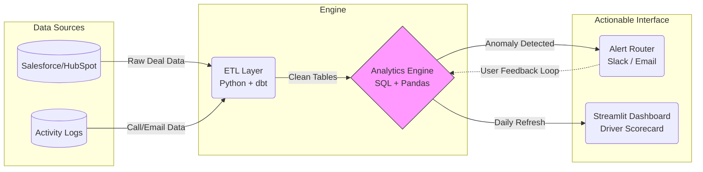

# SkyGeni Sales Intelligence Analysis

## Part 1 – Problem Framing (No Code Required)

### The Real Business Problem
The company is suffering from a "Silent Bleeder" effect. Win rates have dropped from **47.5% (Q4 '23)** to **~43.8% (Q1/Q2 '24)**, but aggregate metrics hide the root cause. Without knowing *why* deals are stalling, leadership is playing a guessing game—wasting resources on bad leads and undertrained reps.

### Key Questions & Metrics
| Question | Metric | Why It Matters |
| :--- | :--- | :--- |
| **Why are we losing?** | **Win Rate Driver Impact** | Isolates exactly *which* segment (Partner, Rep, Industry) is dragging down the average. |
| **Where are deals stuck?** | **Stage Velocity** | Detects if deals are failing early (bad leads) or late (bad closing skills). |
| **Who needs help?** | **Rep Performance Gap** | Measures the widening spread between top and bottom performers. |

### Key Assumptions
*   **Data Integrity:** We assume CRM stage updates are timely and "Lost" reasons are accurate (often not true in reality).
*   **Baseline Validity:** We assume Q4 2023 is a valid benchmark, despite potential year-end seasonality spikes.
*   **Process Consistency:** We assume "Proposed" means the same thing across all regions and reps.

---

## Part 2 – Data Exploration & Insights

### 3 Meaningful Business Insights

| Insight | What We Found | Why It Matters | Action to Take |
| :--- | :--- | :--- | :--- |
| **1. Partner Quality Decay** | Partner win rates dropped **3.7pp** (widening gap). They are **25%** of volume. | We are filling the funnel with "empty calories"—high volume, low quality. | **Audit Partners:** Stop routing leads from "Bronze" partners to senior reps. |
| **2. The "Large Deal" Trap** | Large deals ($30k-60k) have the **lowest win rate (42.9%)**—worse than Enterprise. | "Middle Child" syndrome: Too complex for transactional sales, too small for exec support. | **"Enterprise-Lite" Support:** Assign Sales Engineers to >$30k deals. |
| **3. Rep Variance** | The gap between top/bottom reps widened by **58%** (10.9pp → 17.3pp). | It's not a generic training issue; it's a specific cohort failure. | **Shadowing Program:** Bottom 3 reps must shadow Top rep (`rep_12`) weekly. |

### 2 Custom Metrics Invented

| Metric | Formula | What It Diagnosticizes | Action Threshold |
| :--- | :--- | :--- | :--- |
| **Deal Momentum Decay Index (DMDI)** | `Current Days in Stage / Avg Winning Days in Stage` | **Zombie Deals.** Separates "complex patient deals" from "stalled/dying deals." | **DMDI > 2.0**: Auto-exclude from forecast and move to "Nurture." |
| **Rep-Segment Fit Score (RSFS)** | `Rep Win Rate in Segment / Team Win Rate in Segment` | **Specialization.** Finds hidden superpowers (e.g., Rep A is bad overall but a genius at HealthTech). | **RSFS > 1.2**: Route specific leads *only* to these specialists. |

---

## Part 3 – Build a Decision Engine

**Option Selected:** Option B – Win Rate Driver Analysis

### 1. Problem Definition
We need to move from "We are losing more" to "We are losing specific deals because of X." The goal is attribution, not just prediction.

### 2. The Model: Deterministic Driver Impact Scoring
We chose a **Rule-Based Impact Model** over Black-Box ML for transparency and trust.

**Formula:** `Impact Score = (Segment Win Rate - Benchmark) × Volume Share`
*   *Why:* A 10% drop in a tiny segment implies noise. A 2% drop in a huge segment implies a revenue disaster. This formula bubbles the "disasters" to the top.

### 3. Actionable Outputs (Driver Scorecard)
The system ranks every segment by its negative impact on the global win rate.

| Rank | Driver | Segment | Impact Score | Recommended Action |
| :--- | :--- | :--- | :--- | :--- |
| **1 🔴** | **Lead Source** | **Partner** | **-0.93** | 🔴 **CRITICAL:** Launch Partner Quality Audit immediately. |
| **2 🔴** | **Deal Size** | **Large ($30-60k)** | **-0.38** | 🔴 Review pricing/support for mid-sized deals. |
| **3 🔴** | **Rep Perf.** | **Bottom Cohort** | **-0.32** | 🔴 Put `rep_1`, `rep_11` on Performance Plan. |
| **4 🟢** | **Industry** | **Tech** | **+0.30** | 🟢 **OPPORTUNITY:** Increase ad spend in Tech vertical. |

### 4. How a Sales Leader Uses This
1.  **Monday Morning:** Open Scorecard. See "Partner" is the #1 drag.
2.  **Tactical Action:** Filter pipeline for "Partner" deals and scrutinize them in deal review.
3.  **Strategic Action:** Call VP of Partnerships to renegotiate lead quality terms.

---

## Part 4 – Mini System Design

### Sales Insight & Alert System (SIAS)

**High-Level Architecture:**

### Data Flow & Frequency
1.  **Ingest (Every 6h):** Fetch raw deal data from Salesforce API.
2.  **Process (Daily 6 AM):** Calculate DMDI, RSFS, and Driver Impact Scores.
3.  **Detect (Daily 7 AM):** Compare vs. 90-day baseline. Identify anomalies.
4.  **Act (Daily 8 AM):** Push "Staleness Alerts" to Reps; Push "Driver Insights" to Managers.

### Example Alerts
*   **For Reps:** "⚠️ **Zombie Alert:** Deal 'Acme Corp' has DMDI > 2.5 (Stuck 45 days). Updates required."
*   **For VP of Sales:** "📉 **Trend Alert:** 'Partner' win rate dropped 5% this week. potential revenue risk: $200k."

### Failure Cases
*   **Data Lag:** Reps update CRM only on Fridays. *Mitigation:* Weigh "Activity Logs" (calls/emails) to verify deal stage reality.
*   **Alert Fatigue:** Too many notifications. *Mitigation:* Throttle alerts; only send if Impact Score > Threshold.

---

## Part 5 – Reflection (Most Important)

### Self-Assessment
| Question | Reflection |
| :--- | :--- |
| **Weakest Assumption?** | That **Q4 2023 is a valid baseline**. It likely includes EOY budget flushes/seasonality that inflates win rates, making Q1 look artificially worse. |
| **What breaks in production?** | **Feedback Loops.** If we stop taking Partner leads because of the model, we lose the data needed to see if they improve later. |
| **Build next (1 month)?** | **Real-time "Deal Health" Dashboard.** Moving from *aggregate* analysis (Part 3) to *individual deal* intervention tools for reps. |
| **Least Confident Area?** | **The Custom Metrics (DMDI/RSFS).** They are logical but empirically unproven. I haven't validated if high DMDI *actually* correlates with loss 100% of the time yet. |
